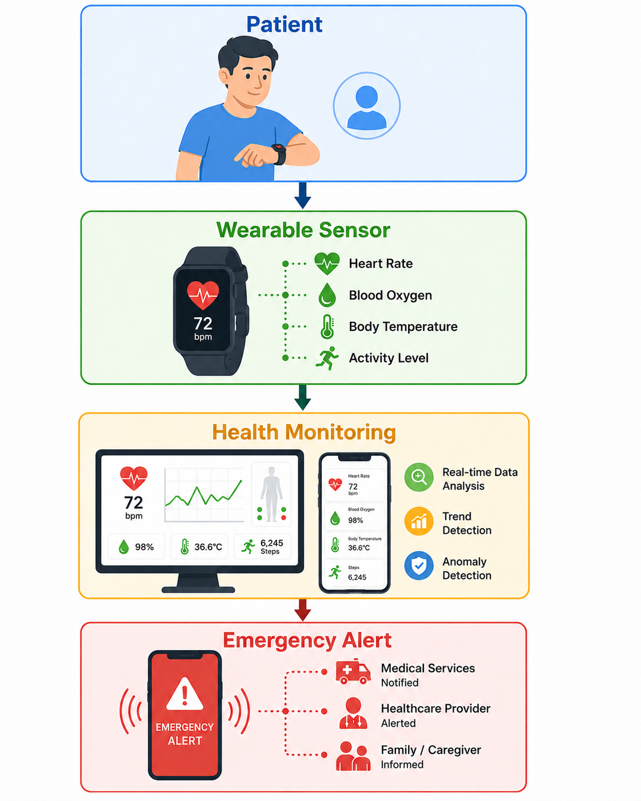

# Healthcare Monitoring

## Descripción

Este ejemplo ilustra una aplicación móvil sensible al contexto para monitoreo de pacientes mediante sensores biométricos.

## Modelo DSL

```cams
application HealthcareMonitoringApp

awareObject Patient category User

contextFeature PatientLocation value GPS relevance High
contextFeature HeartRate value GenericObject relevance High
contextFeature Connectivity value Network relevance Medium

sensor GPS sensorType GPS execution Active configuration Active
sensor WearableSensor sensorType ProgramMonitory execution Active configuration Active

service EmergencyAlert serviceType Firebase
service PatientMap serviceType Google_Maps

rule DetectEmergency
when Patient.HeartRate is Critical
execute EmergencyAlert

rule ShowPatientLocation
when Patient.PatientLocation is available
execute PatientMap

## Arquitectura conceptual


